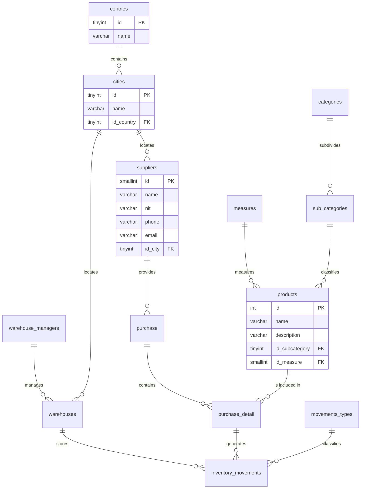

# 🗄️ Riwi Supply

This repository contains the design, structure, and implementation of the relational database for **Riwi Supply**. The system is designed to efficiently manage the supplier purchasing lifecycle, multi-warehouse storage, and historical stock movement tracking.

---

## 🚀 Technologies and Tools

* **Database Engine:** MySQL v8.0+
* **Modeling Tool:** MySQL Workbench
* **ETL / Data Cleaning Strategy:** Data extraction and pre-cleaning using Microsoft Excel or Libre Office (text standardization, duplicate removal, and referential consistency validation prior to insertion).
* **Relational Model Design:** Draw.io

---

## 🗺️ Entity-Relationship Model (ERM)

Below is the relational structure generated in MySQL Workbench. You can visualize the interactive diagram directly on GitHub using the following Mermaid block:

## 👨‍💻 Author

- GitHub: **[Danilo-Doria](https://github.com/Danilo-Doria)**
- LinkedIn: **[Danilo Doria Diaz](https://www.linkedin.com/in/danilodd)**
- Mail: **danilodoria519@gmail.com**